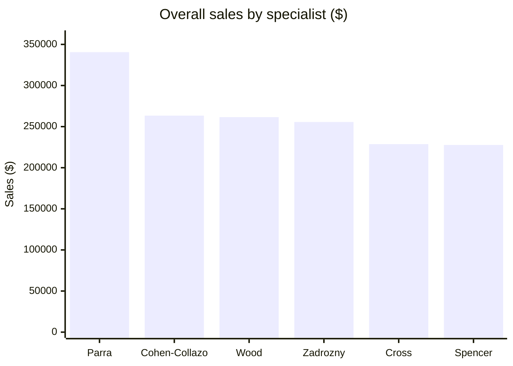

# Daniel Cohen-Collazo

**Sales Professional & AI Builder** | UTSA Information Systems | LangGraph · OpenAI · RAG

Building at the intersection of **sales, AI, and business systems** — quota-carrying sales, outbound prospecting, and hands-on AI automation. I've climbed five roles at The Home Depot (Paint → Cashier → Paint → Flooring Specialist → Millwork Specialist) since 2020.

---

<picture>
  <source media="(prefers-color-scheme: dark)" srcset="./assets/sales-banner-dark.svg">
  
</picture>

## Sales Performance — FY2026 (Jul 2025 – Jul 2026)

| Metric | Value |
| --- | --- |
| Overall Sales | **$360,821** |
| Goal | **$295,462** |
| Above Target | **+$65,246 (+22%)** |
| District Ranking | **#2 of 30 Specialists** |
| D30 Sales | **$291,754** |
| Measures | **#1 in district (101%)** |
| Store Department | **#1 of 11** |

*First year in a specialist seat (Flooring, then Millwork) — ranked #2 of 30 district-wide.*

### District Ranking — Specialists (top 6)

<!-- MONTHLY GROWTH CHART — reserved. Fill once Aug 2025–Jul 2026 monthly totals are verified against $360,821. -->

---

<picture>
  <source media="(prefers-color-scheme: dark)" srcset="./assets/tech-banner-light.svg">
  
</picture>

## Technical Background

UTSA B.B.A. in Information Systems (Cybersecurity concentration, 2026), Johns Hopkins Agentic AI certificate, and hands-on labs in network security, firewall configuration, and traffic analysis. CompTIA Security+ in progress.

### Featured Projects

**Senior Mortgage Underwriting System** — `Python` `LangGraph` `OpenAI` `ChromaDB` `RAG`
Multi-agent system: six agents analyze credit, income, assets, and collateral to generate an audit-ready credit memo and decision — **100% accuracy across three real-world test cases.**

**Autonomous Financial Analyst AI Agent** — `Python` `LangGraph` `OpenAI` `ChromaDB` `RAG`
AI research agent synthesizing financial data, news, and documents into decision-ready, source-cited reports — cutting research time from hours to minutes.

---

## Open To

**Sales:** SDR · BDR · Account Development · Junior AE in B2B SaaS · AI · Cybersecurity
**Technical:** IS / Security analyst, GRC, and automation-adjacent roles
