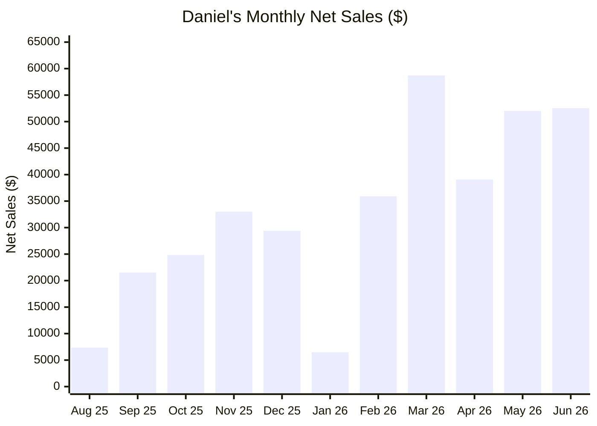

# Daniel Cohen-Collazo

> 🚀 Building at the intersection of **sales, AI, and business systems**. Five roles at The Home Depot since May 2020 (🎨 Paint → 🛒 Cashier → 🎨 Paint → 🪵 Flooring Specialist), promoted into **🏆 Millwork Sales Specialist in Aug 2025** — ranked **#2 of 30** district-wide within the first year.

<picture>
  <source media="(prefers-color-scheme: dark)" srcset="./assets/sales-banner-dark.svg">
  
</picture>

## 💰 Sales Performance

| Metric | Value |
| --- | --- |
| 💵 Total Sales *(since promotion, Aug 2025–present)* | **$360,821** |
| 🥈 District Ranking | **#2 of 30 Specialists** |
| ⚡ D30 Sales | **$291,754** |
| 📏 Measures | **#1 in district (96/95, 101%)** |
| 🏬 Store Department | **#1 of 11** |

*Every dollar below is my own verified transaction history.*

### 📈 My Monthly Net Sales (Aug 2025 – Jun 2026)

*Ramp from promotion (Aug 2025) 📈 to peak months above $52K. Data current through 6/27/2026.*

<picture>
  <source media="(prefers-color-scheme: dark)" srcset="./assets/tech-banner-dark.svg">
  
</picture>

## 🛡️ Technical Background

UTSA B.B.A. in Information Systems (Cybersecurity concentration, 2026); **🎓 Johns Hopkins University, Whiting School of Engineering — Certificate in Agentic AI (Executive & Professional Education, July 2026, 11 CEUs / 110 hours)**; hands-on labs in network security, firewall configuration, and traffic analysis. CompTIA Security+ in progress.

### 🤖 Featured Projects

**🏦 Senior Mortgage Underwriting System**
`Python` `LangGraph` `OpenAI` `ChromaDB` `RAG`
Multi-agent system: six agents analyze credit, income, assets, and collateral to generate an audit-ready credit memo and decision — **100% accuracy across three real-world test cases.**

**📊 Autonomous Financial Analyst AI Agent**
`Python` `LangGraph` `OpenAI` `ChromaDB` `RAG`
AI research agent synthesizing financial data, news, and documents into decision-ready, source-cited reports — cutting research time from hours to minutes.

### 🧰 Tech Stack

## 🎯 Open To

**💼 Sales:** SDR · BDR · Account Development · Junior AE in B2B SaaS · AI · Cybersecurity
**🛡️ Technical:** IS / Security analyst, GRC, and automation-adjacent roles

