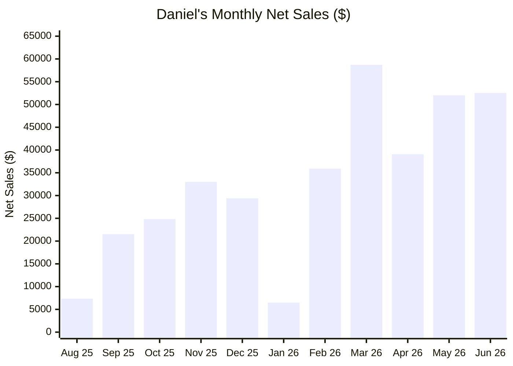

# Daniel Cohen-Collazo
**Sales Professional & AI Builder** | UTSA Information Systems | LangGraph · OpenAI · RAG

Building at the intersection of **sales, AI, and business systems** — quota-carrying sales, outbound prospecting, and hands-on AI automation. Five roles at The Home Depot since May 2020 (Paint Associate → Cashier → Paint Associate → Flooring Specialist), promoted into **Millwork Sales Specialist in Aug 2025** — ranked top of district within the first year in the seat.
---
<picture>
  <source media="(prefers-color-scheme: dark)" srcset="./assets/sales-banner-dark.svg">
  
</picture>
## Sales Performance — FY2026 (Feb 2 – Jul 18, 2026)
| Metric | Value |
| --- | --- |
| Overall Sales | **$313,715** *(incl. $32,817.33 closed, pending application)* |
| Goal | **$181,384** |
| Above Target | **+$132,331 (+73%)** |
| District Ranking | **#2 of 30 Specialists (top 7%)** |
| D30 Sales | **$231,927** |
| Measures | **#1 in district (101%)** |
| Store Department | **#1 of 11** |
*Promoted into the specialist seat in Aug 2025 — ranked #2 of 30 district-wide within the first year.*

### My Monthly Net Sales (Aug 2025 – Jun 2026)

*My own verified transaction history, no district comparison. July 2026 not yet reflected (data current through 6/27).*
---
<picture>
  <source media="(prefers-color-scheme: dark)" srcset="./assets/tech-banner-light.svg">
  
</picture>
## Technical Background
UTSA B.B.A. in Information Systems (Cybersecurity concentration, 2026), Johns Hopkins Agentic AI certificate, and hands-on labs in network security, firewall configuration, and traffic analysis. CompTIA Security+ in progress.

### Featured Projects
**Senior Mortgage Underwriting System** — `Python` `LangGraph` `OpenAI` `ChromaDB` `RAG`
Multi-agent system: six agents analyze credit, income, assets, and collateral to generate an audit-ready credit memo and decision — **100% accuracy across three real-world test cases.**
**Autonomous Financial Analyst AI Agent** — `Python` `LangGraph` `OpenAI` `ChromaDB` `RAG`
AI research agent synthesizing financial data, news, and documents into decision-ready, source-cited reports — cutting research time from hours to minutes.
---
## Open To
**Sales:** SDR · BDR · Account Development · Junior AE in B2B SaaS · AI · Cybersecurity
**Technical:** IS / Security analyst, GRC, and automation-adjacent roles
